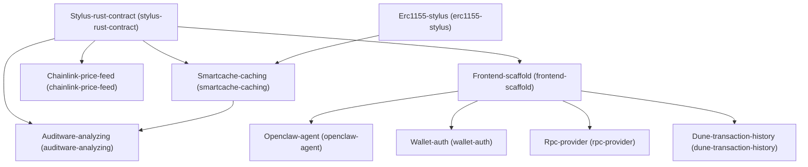

# Architecture

## Dependency Graph

## Execution / Implementation Order

1. **Stylus-rust-contract** (`304ff36c`)
2. **Erc1155-stylus** (`4b63f83b`)
3. **Frontend-scaffold** (`1f88ad43`)
4. **Chainlink-price-feed** (`5ad21144`)
5. **Smartcache-caching** (`bbeb4614`)
6. **Openclaw-agent** (`08509c38`)
7. **Wallet-auth** (`be90ed53`)
8. **Rpc-provider** (`f943dadc`)
9. **Dune-transaction-history** (`84553149`)
10. **Auditware-analyzing** (`b7960b96`)
