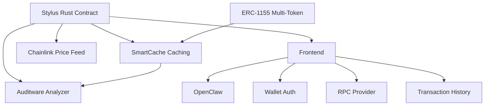

# My App

> A Web3 application composed with [N]skills.

**Network**: Arbitrum Sepolia (Chain ID: 421614) — Testnet
**Keywords**: 

---

## Architecture

## Components

| Component | Type | Category | User Prompt |
|-----------|------|----------|-------------|
| Stylus Rust Contract | `stylus-rust-contract` | contracts | (none) |
| ERC-1155 Multi-Token | `erc1155-stylus` | contracts | (none) |
| Frontend | `frontend-scaffold` | app | (none) |
| Chainlink Price Feed | `chainlink-price-feed` | protocols | (none) |
| SmartCache Caching | `smartcache-caching` | contracts | (none) |
| OpenClaw | `openclaw-agent` | agents | (none) |
| Wallet Auth | `wallet-auth` | app | (none) |
| RPC Provider | `rpc-provider` | app | (none) |
| Transaction History | `dune-transaction-history` | analytics | (none) |
| Auditware Analyzer | `auditware-analyzing` | contracts | (none) |

## Implementation Order

Build the project in this order (respects dependencies):

1. **Stylus Rust Contract** (`stylus-rust-contract`) — see `.nskills/components/stylus-rust-contract--304ff36c.md`
2. **ERC-1155 Multi-Token** (`erc1155-stylus`) — see `.nskills/components/erc1155-stylus--4b63f83b.md`
3. **Frontend** (`frontend-scaffold`) — see `.nskills/components/frontend-scaffold--1f88ad43.md`
4. **Chainlink Price Feed** (`chainlink-price-feed`) — see `.nskills/components/chainlink-price-feed--5ad21144.md`
5. **SmartCache Caching** (`smartcache-caching`) — see `.nskills/components/smartcache-caching--bbeb4614.md`
6. **OpenClaw** (`openclaw-agent`) — see `.nskills/components/openclaw-agent--08509c38.md`
7. **Wallet Auth** (`wallet-auth`) — see `.nskills/components/wallet-auth--be90ed53.md`
8. **RPC Provider** (`rpc-provider`) — see `.nskills/components/rpc-provider--f943dadc.md`
9. **Transaction History** (`dune-transaction-history`) — see `.nskills/components/dune-transaction-history--84553149.md`
10. **Auditware Analyzer** (`auditware-analyzing`) — see `.nskills/components/auditware-analyzing--b7960b96.md`

## Environment Variables

| Key | Description | Required | Default |
|-----|-------------|----------|---------|
| `STYLUS_RPC_URL` | Arbitrum RPC URL for deployment | Yes | https://sepolia-rollup.arbitrum.io/rpc |
| `DEPLOYER_PRIVATE_KEY` | Private key for deployment | Yes |  |
| `NEXT_PUBLIC_ERC1155_ADDRESS` | Deployed ERC1155 multi-token address | No |  |
| `PRIVATE_KEY` | Private key for deployment and transactions | Yes |  |
| `ERC1155_DEPLOYMENT_API_URL` | URL of the ERC1155 deployment API | No | http://localhost:4002 |
| `NEXT_PUBLIC_WALLETCONNECT_PROJECT_ID` | WalletConnect Cloud project ID for wallet connections | Yes |  |
| `NEXT_PUBLIC_APP_NAME` | Application name displayed in wallet dialogs | No | My DApp |
| `CHAINLINK_FEED_ADDRESS` | Chainlink Data Feed contract address (AggregatorV3Interface) | Yes | 0x639Fe6ab55C921f74e7fac1ee960C0B6293ba612 |
| `CHAINLINK_CHAIN` | Chain for Chainlink feed (e.g. ARBITRUM or ARBITRUM_SEPOLIA) | Yes | ARBITRUM |
| `NEXT_PUBLIC_ALCHEMY_API_KEY` | Alchemy API key for RPC access | Yes |  |
| `DUNE_API_KEY` | Dune Analytics API key for blockchain data queries | Yes |  |

## Key Dependencies

| Package | Version |
|---------|---------|
| `next` | `^14.2.0` |
| `react` | `^18.3.0` |
| `react-dom` | `^18.3.0` |
| `wagmi` | `^2.12.0` |
| `viem` | `^2.21.0` |
| `@tanstack/react-query` | `^5.51.0` |
| `@rainbow-me/rainbowkit` | `^2.1.0` |
| `clsx` | `^2.1.0` |
| `tailwind-merge` | `^2.2.0` |
| `ethers` | `^6.13.0` |
| `lucide-react` | `^0.400.0` |
| `@radix-ui/react-select` | `^2.0.0` |
| `@types/node` | `^20.0.0` |
| `@types/react` | `^18.3.0` |
| `@types/react-dom` | `^18.3.0` |
| `typescript` | `^5.4.0` |
| `eslint` | `^8.57.0` |
| `eslint-config-next` | `^14.2.0` |
| `tailwindcss` | `^3.4.0` |
| `postcss` | `^8.4.0` |
| `autoprefixer` | `^10.4.0` |

## Detailed Component Specs

- [Stylus Rust Contract](.nskills/components/stylus-rust-contract--304ff36c.md)
- [ERC-1155 Multi-Token](.nskills/components/erc1155-stylus--4b63f83b.md)
- [Frontend](.nskills/components/frontend-scaffold--1f88ad43.md)
- [Chainlink Price Feed](.nskills/components/chainlink-price-feed--5ad21144.md)
- [SmartCache Caching](.nskills/components/smartcache-caching--bbeb4614.md)
- [OpenClaw](.nskills/components/openclaw-agent--08509c38.md)
- [Wallet Auth](.nskills/components/wallet-auth--be90ed53.md)
- [RPC Provider](.nskills/components/rpc-provider--f943dadc.md)
- [Transaction History](.nskills/components/dune-transaction-history--84553149.md)
- [Auditware Analyzer](.nskills/components/auditware-analyzing--b7960b96.md)

## Additional Context

- [Project Configuration](.nskills/project.md)
- [Full Architecture Details](.nskills/architecture.md)
- [All Environment Variables](.nskills/environment.md)
- [Verified Dependencies](.nskills/dependencies.md)
- [Scripts Reference](.nskills/scripts.md)
- [Integration Map](.nskills/integration-map.md)

---

*Generated by [[N]skills](https://www.nskills.xyz) — Compose N skills for your Web3 project.*
